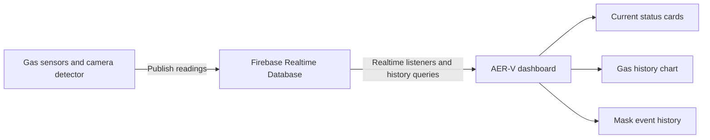

# AER-V

AER-V is a web dashboard for monitoring environmental sensor data and mask-detection activity. It brings live readings and historical records from Firebase Realtime Database into a single responsive interface so operators can quickly understand current conditions and review earlier events.

This repository represents the finalized dashboard direction of an earlier mask-detection experiment. It combines the original monitoring idea with gas-level visualization under the AER-V name.

## What the dashboard shows

- Current readings for ethanol (`C2H5OH`), hydrogen sulfide (`H2S`), and nitrogen dioxide (`NO2`).
- Historical gas readings with gas filters and a selectable date range.
- Current mask-detection status.
- Daily mask and no-mask event history.
- Responsive navigation built with Refine and Ant Design.

## Architecture



The dashboard reads these Firebase paths:

| Path | Purpose |
| --- | --- |
| `sensor_data` | Latest gas sensor readings |
| `ppm_logs/{year}/{month}/{day}` | Historical gas readings |
| `face_detection` | Current mask-detection state |
| `mask_logs/{year}/{month}/{day}` | Historical mask events |

The producer software for the sensor and camera hardware is not included in this dashboard repository.

## Tech stack

- React 18 and TypeScript
- Vite
- Refine
- Ant Design and Ant Design Charts
- Firebase Realtime Database
- Vitest

## Run locally

### Requirements

- Node.js 18 or newer
- npm
- Access to a Firebase Realtime Database with the expected data structure

### Setup

1. Clone the repository.
2. Install dependencies:

   ```bash
   npm install
   ```

3. Review `src/firebaseConfig.ts` and use the Firebase web configuration for your project.
4. Copy `.env.example` to `.env` and set the URL of the camera detection server.
5. Start the development server:

   ```bash
   npm run dev
   ```

6. Open the local URL printed by Vite.

> Firebase web configuration identifies a client application and is visible in browser bundles. Protect the data with Firebase Security Rules and restrict the API key to the intended APIs and domains. Never commit a Firebase Admin SDK service-account file.

## Quality checks

```bash
npm run lint
npm test
npm run build
```

## Deployment

The project includes `netlify.toml` so client-side routes fall back to `index.html`. Before deployment:

1. Configure Firebase Security Rules for the dashboard's read access.
2. Restrict the Firebase API key to the deployed domain.
3. Run lint, tests, and the production build.
4. Deploy the generated `dist/` directory.

## Project background

AER-V started from an experimental mask-detection project and evolved into a broader monitoring dashboard. The current repository keeps that history while presenting the final purpose clearly: visualize environmental gas readings and mask-detection events in one place.

The interface was bootstrapped from a Refine dashboard example and then adapted for the AER-V monitoring use case. Refine, Ant Design, Firebase, and the other dependencies remain subject to their respective licenses.

## Current limitations

- The dashboard expects an existing Firebase data producer.
- Firebase Security Rules are managed outside this repository.
- Hardware integration and model training are outside the dashboard codebase.
- Browser tests against a live Firebase project are not included; automated tests currently cover deterministic utility logic.
